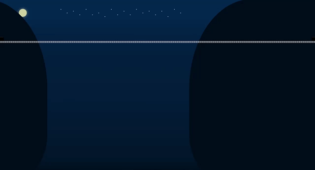

# CSS Train 🚆

> Train animation using pure CSS 🛤

### See the <a href='https://dnt-knw.github.io/CSS-train' target='_blank' title='Click to open the project'>Demo</a> 👁

❗️ Wait a few seconds to see the train ❗️

## Description 📖

- 📜 Night animation of the train leaving a tunnel ⬛️
- 📜 The background contains
    - Mountains ⛰
    - Sea 🌊
    - Stars 🌟
    - Moon 🌕
